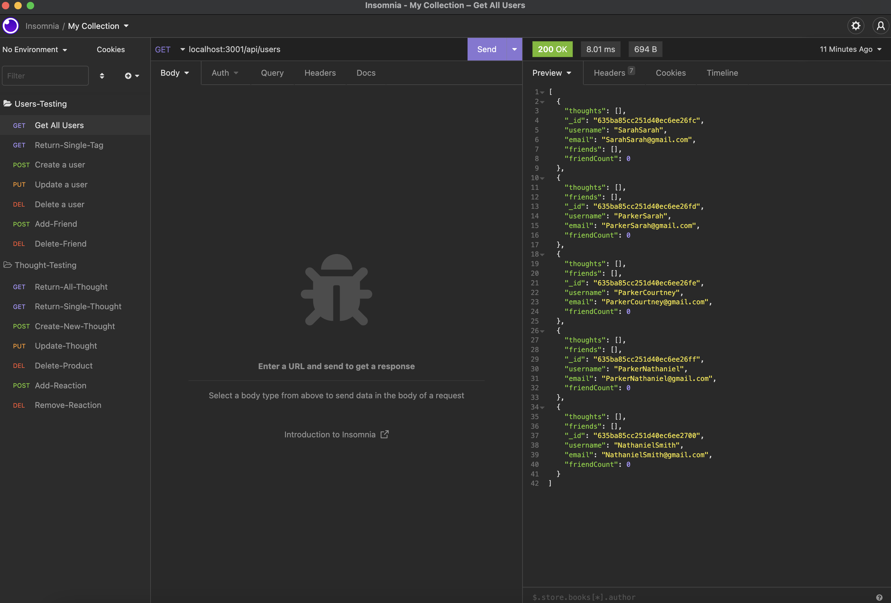

# NoSQL Challenge: Social Network API
  

## Description
This application allows you to write users data, save users data and deletes that are being stored in a db.json file. It runs on node.js and uses express.js to route all the get, post and delete methods.  

## Table of Contents
- [Description](#description)
- [Table of Contents](#table-of-contents)
- [Installation](#installation)
- [Usage](#usage)
- [Demo](#demo)
- [Built With](#built-with)
- [License](#license)
- [Contributing](#contributing)
- [Tests](#tests)
- [Questions](#questions)

## Installation
`git clone` the repo to your local machine. To use this application, run the following command to install the dependencies: 

    npm install
    npm i moment
    npm i mongoose

Then run the following command to seed the database:

`node utils/seed`

## Usage
Type the following command in your termimal:

`node index.js`

Then open Insomnia and type http://localhost:3001/ to run this application on your local machine.

## Demo
Below is the demostration of this application. Please click <a href="https://youtu.be/O38Q_oHzDcc" target="_blank">here</a> for walk-through video.

## Built With

* [HTML](https://developer.mozilla.org/en-US/docs/Web/HTML)
* [CSS](https://developer.mozilla.org/en-US/docs/Web/CSS)
* [Javascript](https://developer.mozilla.org/en-US/docs/Web/Javascript)
* [NodeJS](https://nodejs.org/en/)
* [ExpressJS](https://expressjs.com/)
  

## Contributing
This application is developed by Duc Dang. If you would like to contribute it, please follow the guidelines for how to do so.

## Tests
To run tests on the application, run

`npm install jest`

and then `npm run test` from the command line.

## License

Copyright (c) [2022] [Duc Dang]

## Questions

### Contact:

Github: [https://github.com/simpmind](https://github.com/simpmind)

Email: <tengfai97@gmail.com>

